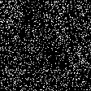

# Transferability and Continual learning

## NEWS

-----------------------------


Official repository of Relationship between Transferability and Continual learning

<p align="center">
  
  
  
  
  
  
</p>

## Setup

+ Create a virtual environment:
```
python -m venv venv
```
+ Activate it using `venv/Scripts/activate`.
+ Install requirement package `pip install -r requirements.txt`.
+ Install some `torch` packages for GPU.
```
pip3 install torch==2.0.1+cu118 torchvision==0.15.2+cu118 torchaudio==2.0.2+cu118 -f https://download.pytorch.org/whl/cu102/torch_stable.html
```

+ Use `./utils/main.py` to run experiments.
+ Note that argument `--case` is the name of the corresponding file in the `./benchmark` folder.
+ Percentage of buffer used in each class is $\frac{\text{buffer-size}/\text{n-class-per-task}}{\text{n-sample-per-class}}$.
+ Change the `--buffer_size` to 180, 360, 900, 1800 for running experiments.

+ ## ER

+ Run the experiments on 5 tasks in CIFAR-10 dataset, adjust buffer by `360`, `900`, `1800` and `3600`:
```
python utils/main.py --model er --dataset random-cifar10 --n_class_per_task 3 --n_task_per_seq 5 --num_seq 100 --case 5task_1mutual_cifar10 --buffer_size 1800 --lr 0.1 --minibatch_size 32 --batch_size 32 --n_epochs 50
```
+ Run the experiments on 10 tasks in CIFAR-100 dataset, adjust buffer by `360`, `900`, `1800` and `3600`:
```
python utils/main.py --model derpp --dataset random-cifar10 --n_class_per_task 10 --n_task_per_seq 10 --num_seq 100 --case 10task_disjoint_cifar100 --buffer_size 1800 --lr 0.1 --minibatch_size 32 --batch_size 32 --n_epochs 50
```
+ Run the experiments on 10 tasks in tinyImageNet dataset, adjust buffer by `360`, `900`, `1800` and `3600`:
```
python utils/main.py --model derpp --dataset random-tinyimg --n_class_per_task 20 --n_task_per_seq 10 --num_seq 100 --case 10task_disjoint_tinyimg --buffer_size 1800 --lr 0.1 --minibatch_size 32 --batch_size 32 --n_epochs 100
```

## DERPP

+ Run the experiments on 5 task in CIFAR-10 dataset, adjust buffer by `360`, `900`, `1800` and `3600`:
```
python utils/main.py --model derpp --dataset random-cifar10 --n_class_per_task 3 --n_task_per_seq 5 --num_seq 100 --case 5task_1mutual_cifar10 --buffer_size 1800 --lr 0.03 --minibatch_size 32 --batch_size 32 --alpha 0.1 --beta 0.5 --n_epochs 50
```
+ Run the experiments on 10 tasks in CIFAR-100 dataset, adjust buffer by `360`, `900`, `1800` and `3600`:
```
python utils/main.py --model derpp --dataset random-cifar10 --n_class_per_task 10 --n_task_per_seq 10 --num_seq 100 --case 10task_disjoint_cifar100 --buffer_size 1800 --lr 0.03 --minibatch_size 32 --batch_size 32 --alpha 0.1 --beta 0.5 --n_epochs 50
```
+ Run the experiments on 10 tasks in tinyImageNet dataset, adjust buffer by `360`, `900`, `1800` and `3600`:
```
python utils/main.py --model derpp --dataset random-tinyimg --n_class_per_task 20 --n_task_per_seq 10 --num_seq 100 --case 10task_disjoint_tinyimg --buffer_size 1800 --lr 0.03 --minibatch_size 32 --batch_size 32 --alpha 0.2 --beta 0.5 --n_epochs 100
```

## XDER

+ Run the experiments on 5 task in CIFAR-10 dataset, adjust buffer by `360`, `900`, `1800` and `3600`:
```
python utils/main.py --model xder --dataset random-cifar10 --num_seq 100 --n_class_per_task 3 --n_task_per_seq 5 --case cifar10_357911 --buffer_size 1800 --lr 0.03 --minibatch_size 32 --batch_size 32 --m 0.7 --alpha 0.2 --beta 1.0 --gamma 0.85 --optim_wd 0 --lambd 0.05 --eta 0.001 --simclr_temp 5 --optim_mom 1e-06 --simclr_batch_size 32 --simclr_num_aug 2 --n_epochs 50
```
+ Run the experiments on 10 task in CIFAR-100 dataset, adjust buffer by `360`, `900`, `1800` and `3600`:
```
python utils/main.py --model xder --dataset random-cifar100 --num_seq 100 --n_class_per_task 10 --n_task_per_seq 10 --case 10task_disjoint_cifar100 --buffer_size 1800 --lr 0.03 --minibatch_size 32 --batch_size 32 --m 0.7 --alpha 0.3 --beta 0.8 --gamma 0.85 --optim_wd 0 --lambd 0.05 --eta 0.001 --simclr_temp 5 --optim_mom 0 --simclr_batch_size 64 --simclr_num_aug 2 --n_epochs 50
```
+ Run the experiments on 10 task in tinyImageNet dataset, adjust buffer by `360`, `900`, `1800` and `3600`:
```
python utils/main.py --model xder --dataset random-tinyimg --num_seq 100 --n_class_per_task 20 --n_task_per_seq 10 --case 10task_disjoint_tinyimg --buffer_size 1800 --lr 0.03 --minibatch_size 32 --batch_size 32 --m 0.7 --alpha 0.3 --beta 0.8 --gamma 0.85 --optim_wd 0 --lambd 0.05 --eta 0.001 --simclr_temp 5 --optim_mom 0 --simclr_batch_size 64 --simclr_num_aug 2 --n_epochs 100
```
