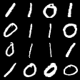

# Relationship between Transferability and Continual learning

## NEWS

-----------------------------


Official repository of Relationship between Transferability and Continual learning

<p align="center">
  
  
  
  
  
  
</p>

## Setup

+ Use `./utils/main.py` to run experiments.
+ Note that argument `--case` is the name of the corresponding file in the `./benchmark` folder.
+ Percentage of buffer used in each class is $\frac{\text{buffer_size}/\text{n_class_per_task}}{\text{n_sample_per_class}}$.
+ Run the experiments on 5 task in CIFAR-10 dataset:
```
python utils/main.py --model derpp --dataset random-cifar10 --n_class_per_task 3 --n_task_per_seq 5 --case cifar10_357911 --buffer_size 1800 --lr 0.03 --minibatch_size 32 --batch_size 32 --alpha 0.1 --beta 0.5 --n_epochs 50
```
+ Run the experiments on 3 task in MNIST dataset:
```
python utils/main.py --model derpp --dataset random-mnist --n_class_per_task 3 --n_task_per_seq 3 --case 359 --buffer_size 1800 --lr 0.03 --minibatch_size 32 --batch_size 32 --alpha 0.1 --beta 0.5 --n_epochs 50
```
